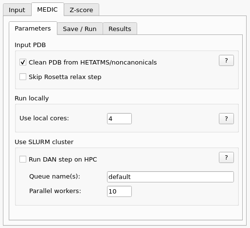
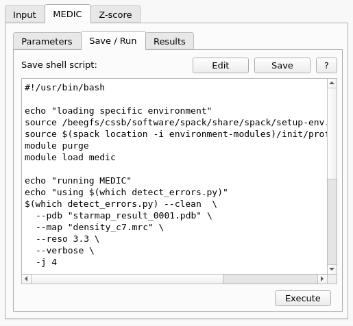
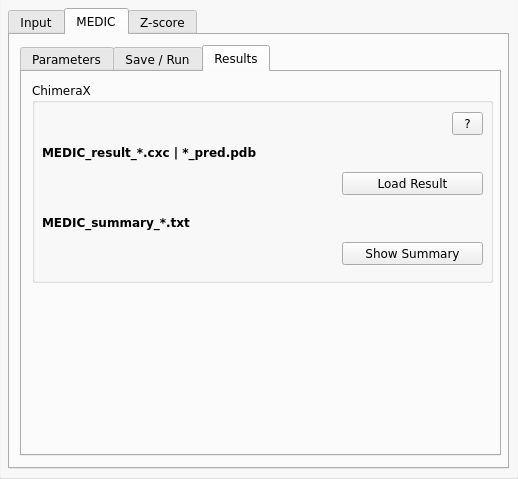
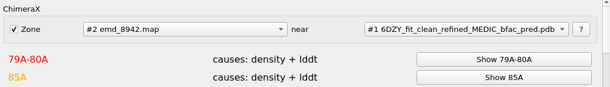

.. _analysis_medic_tab:

.. index:: MEDIC

Analysis with MEDIC
===================

An improved and extended version of the *Z-scores* is the external *MEDIC* software.
A beginners help for setting up the *miniconda* environment for *MEDIC* can be found on (:ref:`medic_conda_howto`).
On Windows 10+ *MEDIC* must be installed in the *WSL2* subsystem.

The *MEDIC* interface comes in three subtabs.

Runtime Parameters
------------------

Most likely you do not need changes here if you work on a local workstation.

Parameters
^^^^^^^^^^

* **Clean PDB**:
  If your structure has ligands or nucleac acids or noncanonical amino acids check this box.
  It is checked by default to ensure a successful run.

* **Skip Rosetta relax step**:
  Only check this if your PDB is from a previous *Rosetta/MEDIC* run if you want to speed up.
  You can choose the **_refined.pdb** in the *Input* tab.
  But be aware that this changes the name of the output file and the *MEDIC* template must also be changed.

Run locally
^^^^^^^^^^^

* **Use local cores**:
  This value depends if you have installed *PyTorch* inside the *MEDIC* conda environment for GPUs or CPUs.
  Default is **4**, change this for more parallel tasks but do not use more cores than your local node has (if you use CPU computing).
  *Note:* On GPUs *4* works on a *RTX 1080Ti* GPU with 12GB, for a *RTX 3060* with 6GB use *2* if you process locally.

Use SLURM cluster
^^^^^^^^^^^^^^^^^

* **Run DAN step on HPC**:
  Check this if you have a SLURM cluster and want to parallelize parts of the analysis on GPU compute nodes.
  Only *SLURM* is supported at this time. MEDIC creates lots of small, short-time jobs. So if you have longer
  waiting times in the queuing system it might be faster to run this step locally.
  The *Run locally* values are ignored if this section is *checked*. 

* **Queue name(s)**:
  Choose a queue/partition name where you have access to. For more queues add a '**,**' and no space like *cssbgpu,allgpu*.
  *SLURM* tries to find free nodes in the list from left to right.

* **Parallel workers**:
  Amount of parallel jobs.

Save/Run
--------

Save a runnable *Bash* script, modify and *Execute* it.

Prepare runtime script
^^^^^^^^^^^^^^^^^^^^^^

* **Save**:
  Uses the template file *starmap_medic.tmpl.sh* from the local working directory or from the *STARMAP_TEMPLATES_DIR* 
  environment location or finally the one from the *StarMap* distribution and generates a runable *Bash* script for execution.
  
  To generate your own template, type **stmconfig** in the *ChimeraX* command line and copy the file from the
  **MEDIC_SCRIPT_TEMPLATE** entry to your local folder and edit it.

* **Edit/Cancel**:
  If you press the *Edit* button, the previous read-only display widget will enable editing and the name of the button changes to *Cancel*.
  The editing mode will end when you press the *Save* button again.
  Pressing the *Cancel* button disables editing in the widget, *reloads* the script from the file system and toggles the name to *Edit* again.

* **Execute**:
  The generated and/or edited script will be executed as a local thread on the node where *ChimeraX* is running.
  Estimated runtime is 15-45 minutes.
  The script will continue executing if you close *ChimeraX*.
  If you run *ChimeraX* for *Microsoft Windows* then *MEDIC* will be executed via *WSL*.

Results
-------

Here the result script names will be preset if *ChimeraX* was not closed meanwhile.

* **Load Result**:
  Our *MEDIC* runtime template will generate a *CXC* script which opens the *map* and the *PDB* and presets some *ChimeraX* values
  like coloring the results based on thresholds. Finally it calls the command to open the *MEDIC Summary* popup window.

  If *ChimeraX* was closed meanwhile a file selector box will let you choose a **_pred.pdb** or **CXC** file.
  This might be useful if your *MEDIC* run was on a compute cluster and you want to analyse the results on your local PC/laptop.
  
  When opening the *MEDIC* result *_pred.PDB* here or with the *ChimeraX* **Open** command
  you can use your own color codes as described on the *MEDIC* homepage. 
  
* **Show Summary**:
  If you do not use our *MEDIC* template you can open the **_pred.pdb** and the **map** in *ChimeraX* and then choose the
  the corresponding *MEDIC* summary file here. It will open the *MEDIC Summary* popup window.

MEDIC Summary
-------------

This window is a parsed representation of the *MEDIC* summary text file and will help you to inspect problematic zones in your structure.
*Red* entries are *definite error* results, *orange* are the *possible error* results of the  *MEDIC* run.

* **Zone**:
  Normally you would see the full density  around your selected residues which could make things hard to see.
  If the checkbox is enabled (default) a *ChimeraX* **zone** the *map* near the selected residues from the model will be called.
  If not preset choose your *map* in the first pulldown menu and the *PDB* in the second one.

* **Show**:
  The residues mentioned on the button will be selected and a *ChimeraX* **zoom** command to them will be triggered.
  If the *Zone* checkbox is selected above, this will also be triggered here.
