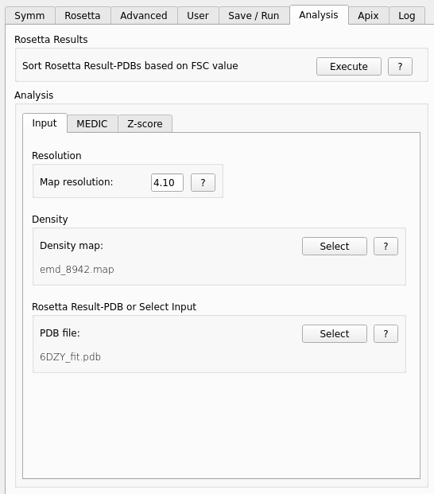

.. _analysis_tab:

.. index:: Analysis

Analysis Tab
============

On this tab previous generated or external data can be analyzed.

Rosetta Results
---------------

After a successful run of *Rosetta* the result PDBs can be sorted based on the FSC value by pressing the **Execute** button.
This means the PDBs with the best value get re-ordered to the name *starmap_result_0001.pdb*, the second best to *...0002.pdb* etc.

Analysis
--------

Here you can select the external input data for analysis.

.. index:: Density map

Density
^^^^^^^

The input density map for the FSC calculation.
This value will be preset with the same one as in the *Rosetta* tab.
You can choose a different one by pressing the **Select** button.

If a *half2* map was choosen in the *Advanced* tab, you should use here also the *half2* map here (if not already preset).

Rosetta Result PDB
^^^^^^^^^^^^^^^^^^

**Select** the input PDB file for the analysis.

.. index:: Map resolution

Resolution
^^^^^^^^^^

The **Map resolution** value is preset from the *Rosetta* tab and can be set if external input data are used.

Graphs
^^^^^^

* **Execute**:
  Choose on which values the FSC will be calculated.
  The calculation can be 5 seconds up to 5+ minutes depending on your input data and chosen option.
  *ChimeraX* is blocked during the execution. When the calculation is finished the **Preview** button changes its color.

  After the execution *StarMap* prepares multiple **.cxc** scripts for coloring of the Z-score values in the working folder
  for highlightning ribbons in *ChimeraX*.
  To use it open the input *.pdb* file first and then open the corresponding **.cxc** file.

  The generated **.vsz** files can be loaded in the *Veusz* program to generate professional graphs.
  The **.vsz** files need also the assoziated **.csv** files in this directory.

* **Preview**:
  Based on the selected option the corresponding graph will be shown in a pop-up window.
  If the results contain multiple chains, a image for each chain will be generated.

.. index:: Veusz

Cleanup
^^^^^^^

* **Cleanup**:
  Deletes the *.err* and *.out* files and intermediate script files.

Notes on Z-score
^^^^^^^^^^^^^^^^

If you run the **LCC per residue** the **LCC zscore per residue** calculation is also done.

The Z-score in *StarMap* comes from the sum of four values that are calculated separately and weighted differently:

**Z_density Z_neighborhood_density Z_rama Z_bondstrain**

The combined score uses weights of 0.45, 0.05, 0.15, and 0.35 on these terms respectively.

So Z-score = Z_density*0.45 +  Z_neighborhood_density*0.05 +  Z_rama*0.15 + Z_bondstrain*0.35

