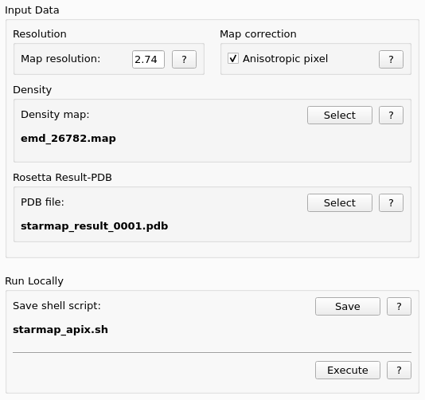

.. _apix_tab:

Apix Tab
========

.. index:: Apix

Imperfection of the microscope optics may result in a difference between nominal and actual pixel size (voxel) in the obtained cryo-EM map.
Once the model is placed inside the map, the pixel size can be confirmed or calibrated based on the absolute bond lengths of the model.
This operation is particularly useful for maps with large box sizes, such as viruses. Since the pixel size affects the resolution
estimate of the map or in case of helical assemblies also the helical rise, which is measured in A, reprocessing of cryo-EM data with
a calibrated pixel size is thus recommended.
This analysis step can be run independently from model refinement, e.g. using the deposited maps and models.

Input Data
^^^^^^^^^^

Resolution
^^^^^^^^^^

* **Map Resolution**:
  The density map resolution. Should be the same value as used later in the *Analysis* tab.

.. index:: Density map

Map correction
^^^^^^^^^^^^^^

With the *Anisotropic pixel* checkbox on (default) Rosetta will try to make rectangular pixels in the map, which may crash other programs. 
By unticking the pixel size will be changed in the map, but it will stay square.

Density
^^^^^^^

The input density map for the Apix calculation.
This value will be preset with the same one as in the *Rosetta* tab.
You can choose a different one by pressing the **Select** button.

Rosetta Result PDB
------------------

**Select** the best Rosetta output PDB file for the run.

Run Locally
-----------

Save shell script
^^^^^^^^^^^^^^^^^

Apix calculation is done using 1 core. So the *Use local cores* field is not editable.
StarMap comes with one premade ready-to-use *Rosetta* XML file for this special calculation.
The corresponding shell script is simple and has the usual name for this session, but adds a *_apix* to the file name before the suffix.

Execute Apix script
^^^^^^^^^^^^^^^^^^^

By pressing the *Execute* button the local script is executed using 1 computing core and the output is redirected to the log tab.
During the script execution the user interface is not blocked.
If a new job is started while the old one is still running, the logs of the new job will be shown in the log window.
The logs the old job can be monitored on the external command line with Unix tools like *tail -f*.

Log files of local jobs are located in the working folder and get the name of the script and suffix **.out** for *stdout* and **.err** for *stderr*.

The result of the run is a map file ending with **_apix.mrc** or **_apix.map** which contains the pixel-calibrated map
and a PDB file ending with **_apix_bfactor.pdb**, which has the refined B-factor assigned to each atom based on the pixel-calibrated map.

