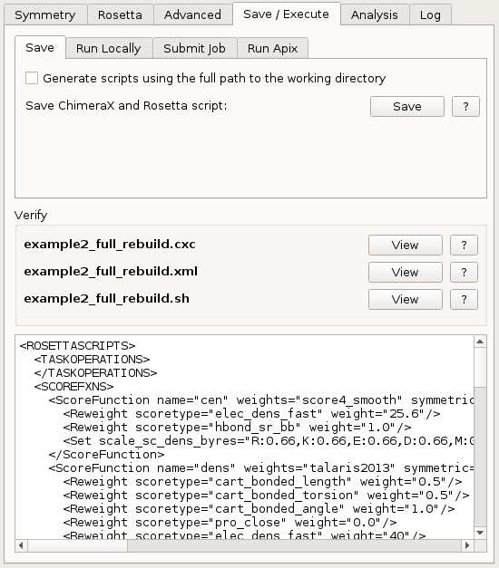
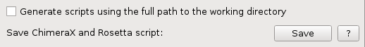
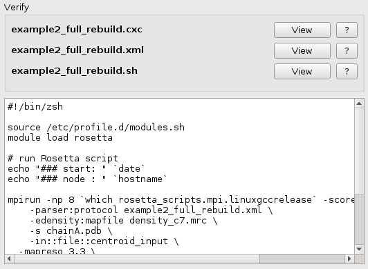
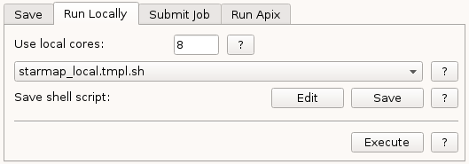
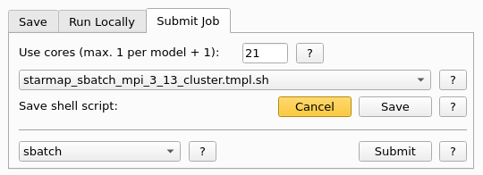

.. _execute_tab:

Execute Tab
===========

In this tab you can save the settings as a *ChimeraX* script and generate runtime execution scripts for *Rosetta*.
When *Rosetta* is available for this platform and also installed, the analysis can be executed in the background.

.. index:: Save
.. index:: Cores
.. index:: MPI

.. _templates:

Templates
---------

*StarMap* comes with example shell script templates. If you want to modify or provide templates for your special
environment (e.g. a HPC environment) you can put them together in a dedicated directory and set an environment variable called
**STARMAP_TEMPLATES_DIR** to it.

  e.g. *export STARMAP_TEMPLATES_DIR=${HOME}/templates*

According to the file name these shell templates are added to the corresponding tabs as follows:

* File names containing **local** are added to the `Run Locally Tab`_ pull-down list.
* File names containing **cluster** are added to the `Submit Job Tab`_ pull-down list.

Save Tab
--------

This tab saves the *StarMap* settings and generates the proper *Rosetta* XML script for later execution.
These two scripts are independent on how *Rosetta* will be executed on the target platform.
The execution shell script must be generated in the other sub-tabs because the user can choose later
anytime if the analysis should be executed locally or sent to a computing cluster.
The filename choosen during saving here will be used with different suffixes for all generated scripts.

Save scripts
^^^^^^^^^^^^

Save the status as *ChimeraX* command script and generate the execution *Rosetta* XML script.

* **Generate scripts using the full path to the working directory**:
  If on, the generated *Rosetta* and shell script will contain full pathname to the files,
  otherwise only the filename without directory part is used.
  This option is useful if not all files are located in the working directory.
  Use no path if you plan to execute the scripts on a different location e.g. a remote cluster
  or you generate the scripts on a platform where *Rosetta* is not available.
  
  On *Windows* operating systems this checkbox is **disabled** to avoid confusion between Windows *C:\\* and WSL */mnt/c*.

* **Save**:
  The *Save* buttons let you choose the name of the shell script without suffix.
  The selected name of the file dialog will be cut by the first **.** in the name and extended by the predefined suffixes.

  All scripts share the same base name and get the *suffix* as follows:

  * The *Bash* execution script gets the suffix **.sh**.
  * The *Rosetta* runtime script gets the suffix **.xml**.
  * The *current settings* are saved as ChimeraX runtime script **.cxc**.

Verify scripts
^^^^^^^^^^^^^^

Here the generated filenames are displayed and the contents can be viewed.

* **View**:
  The *View* button shows the content of the file in the scrollable area below.

Run Locally Tab
---------------

Here you can generate the *Bash* script for execution on the local system.

Use local cores
^^^^^^^^^^^^^^^

*Rosetta* uses 1 core per model for calculation.
The pre-filled value is the amount of cores reported by the operating system.
Since only *Rosetta* static executables are available on MacOS the local cores are set there to *1* by default.
If the value is set to *1*, make sure to use a non-MPI template for the script generation.

If you want to parallelize the calculation use as a *minimum* a value larger than *2* and a MPI script template.
With MPI another core must be added for the leader process.

The *maximum* useful value is either
  * the lower value of the amount of cores or
  * the number of models to calculate.

Local script templates
^^^^^^^^^^^^^^^^^^^^^^

*StarMap* comes with some script template examples.
You can edit the script after generation or add a new script template with the filename ending *_local.tmpl.sh* to the template directory.

Save local script
^^^^^^^^^^^^^^^^^

Choose the script template and the amount of cores and *save* the script.
The script will have the same name as the *ChimeraX* command file and the *Rosetta* XML file in the *Save* sub-tab.
The contents of the generated script can be checked in the area below of the *Verify* section.

If you press the *Edit* button, the previous read-only display widget will enable editing and the name of the button changes to *Cancel*.
The editing mode will end when you press the *Save* button again.
Pressing the *Cancel* button disables editing in the widget, *reloads* the script from the file system and toggles the name to *Edit* again.

Execute local script
^^^^^^^^^^^^^^^^^^^^

By pressing the *Execute* button the local script is executed and the output is redirected to the *Log* tab of *StarMap*
as long as you do not switch to other tabs.
During the script execution the user interface is not blocked so other tasks in *ChimeraX* can be done meanwhile.
If a new job is started while the old one is still running, the logs of the new job will be shown in the log window.
The logs the old job can be monitored on the external command line with Unix tools like *tail -f*.
Local *Rosetta* jobs cannot be stopped from *StarMap* and *ChimeraX* can be closed when executing longer analysis runs.
Please refer to the platform and operating system documentation on how to stop *Rosetta* before it finishes automatically.

Log files of local jobs are located in the working folder and get the name of the script
and suffix **.out** for *stdout* and **.err** for *stderr* messages.

Submit Job Tab
--------------

Here you can generate the *Bash* script for submitting it to a remote computing cluster using a job queueing system.

Use cores
^^^^^^^^^

*Rosetta* uses 1 core per model for calculation.
The pre-filled value is the number of output models set in the *Rosetta* tab.
There is no speed-up of the calculation if you put a higher number than the number of output models.
If the value is set to *1*, make sure to use a non-MPI template for the script generation.
With MPI another core must be added for the leader process. This value is most likely preset already when the amount of models are choosen.

Submission script templates
^^^^^^^^^^^^^^^^^^^^^^^^^^^

*StarMap* comes with some script template examples.
More template examples are located in the *examples* folder from our website (:ref:`references`).

The *Rosetta* commandline differs between version **3.8** and later versions.
See the examples with the file ending **_r38_cluster.tmpl.sh** (*Rosetta 3.8*) and others for the different options.
You can edit the script after generation or add a new script template with the suffix *_cluster.tmpl.sh* to the template
installation directory.

Save submission script
^^^^^^^^^^^^^^^^^^^^^^

Choose the script template and the amount of cores and *save* the script.
The script will have the same name as the ChimeraX command file and the *Rosetta* XML file in the *Save* sub-tab.
The contents of the generated script can be checked in the area below of the *Verify* section.

If you press the *Edit* button, the previous read-only display widget will enable editing and the name of the button changes to *Cancel* and gets an *orange* color to notify the editing mode.
The editing mode will end when you press the *Save* button again and the button color changes from *orange* to default settings.
Pressing the *Cancel* button disables editing in the widget, *reloads* the script from the file system and toggles the name to *Edit* again.

Submission command
^^^^^^^^^^^^^^^^^^

The selected command will be used to submit the generated batch script to a cluster or local queue.
The command must be in the system path.

The following submission commands can be selected:

  * **sbatch**: SLURM workload manager
  * **qsub**: Grid Scheduler and OpenPBS workload manager
  * **bsub**: IBM Spectrum LSF
  * **ts**: Task Spooler

.. index:: ts
.. index:: sbatch
.. index:: qsub
.. index:: bsub

Submit script
^^^^^^^^^^^^^

By pressing the *Submit* button the local script is submitted to the workload management system.
After submission the external tools of the choosen workload management system must be used handle and monitor the submitted job.

The names and location of log files of the submitted jobs can be changed in the submission script template.

