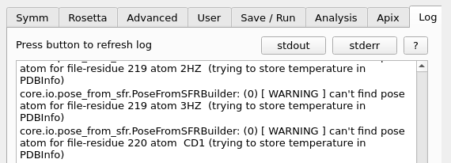

.. _log_tab:

.. index:: Log

Log Tab
=======

On this tab the output and error logs of the last started external program can be viewed.

**The logs are not automatically refreshed!**
Some *Rosetta* log files can get a few MB and therefore permanent loading can take some time.
So only the last few lines are displayed in the output when you press the proper button.

The **stdout** button shows the last lines of the normal execution log.
If supported by the tool, the **stderr** button shows the last lines of the error messages.
To get a full log view, the files must be opened in an external text editor.

The logs of a job submitted to a workload manager are NOT shown.
To see them use the proper tools or command line commands.

During the startup of the external job execution, the path and name of the log file is displayed in the *stdout* window.

