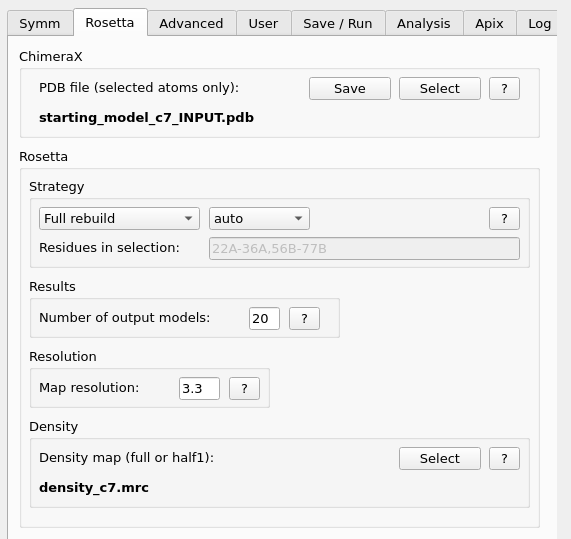

.. _rosetta_tab:

.. index:: Rosetta

Rosetta Tab
===========

This tab provides the starting point for the most commonly used *Rosetta* refinements.
It is divided in two sections. First, the selected input data must be saved in *ChimeraX*
or selected from the filesystem. Second, the choosen *Rosetta* strategy and additional
settings must selected before saving and executing the analysis.

ChimeraX
--------

Select your used atoms for refinement in *ChimeraX* e.g. the following example selects chain A,B,C and F in model 1::

  sel #1 /A-C,F

* **PDB file (selected atoms only)**:
  Choose the selected atoms for further analysis.
  If symmetry was detected by using *Alternative 2 (advanced)* from the Symmetry tab, then the appropriate
  input PDB file is already selected here (suffix *_INPUT.pdb*).

* **Save**:
  Once the atoms are selected they must be saved in a PDB file by pressing this button and
  choosing a file name with the extension *.pdb*.
  If nothing was selected a simple basic *pdb* file will be generated.
  This command uses the ChimeraX *save* command e.g. *save chainA.pdb selectedOnly true*.

* **Select**:
  Alternatively a previous saved *.pdb* file can be selected here.
  This file will not be opened in *ChimeraX*.

Strategy
--------

The choosen strategy is important for the expected results and comes with two selection possibilities
in the StarMap user interface.
First a rebuilding or refinement strategy and second the used residues of the dataset can be choosen.

* **Strategy**:
  Can be *Full rebuild*, *Minimal rebuild*, *Refinement only* (cartesian refine) and *Torsian refine*.

    * **Full rebuild**:
      Perform multiple iterations of backbone sampling followed by side-chain rebuilding and all-atom refinement.
    * **Minimal rebuild**:
      Same as full rebuild, but only one iteration is performed. This mode is helpful for polishing the model,
      for instance, after a refinement followed by manual adjustments in *Coot* or *ISOLDE*.
    * **Refinement only**:
      Perform side-chain rebuilding and all-atom refinement in Cartesian space.
      Only run cartesian or torsian model refinement, do not rebuild backbone residues.
      This approach is particulary useful for maps with worse than *~5A* resolution.
    * **Torsian refine**:
      Perform side-chain rebuilding and all-atom refinement in torsian ("internal coordinate") space.
      This approach is useful for models with large domain motions where the resolution is too low for the
      *Full rebuild* to converge. Recommened for maps worse  than *~5A* resolution.

  All these rebuilding and refinement strategies can be combined with automatic or user defined residues.
    * **auto**:
      Detect and rebuild poorly modelled regions by analyzing the Ramachandran score, bond lengths and
      angles as well as fit into the density.
    * **user**, **Residues in selection**:
      Provide a comma-seperated list of short residue specifications to be refined.
      Each value can be in a range e.g. *22A-36A,56B-77B*.

.. _results_number:

Results
-------

* **Number of output models**:
  Set the number of output models, i.e. how many PDB files will be generated as result files.
  Each output model is calculated independently by a *Rosetta* process using one computing core.
  MPI-enabled *Rosetta* (see :ref:`rosetta_best_practice`) can calculate output models in parallel at one or more computing nodes.
  The *StarMap* user interface suggests and presets useful values for the chosen  *Strategy*.
  By default, *Full rebuild* generates 20 output models, *Minimal rebuild* generates 10,
  while *Minimal refinement* and *Torsion refinement* default to 1.

Resolution
----------

* **Map Resolution**:
  Enter the gold-standard resolution of your density map.
  Enter the value and press the *Return* or *Tab* button to update also the corresponding value in the *Analysis* tab.

Density
-------

* **Densitiy map (full or half1)**:
  Choose a full density map or one of the two half maps for analysis.
  The path and filename will be used in the execution script of Rosetta.

* **Select**:
  The *.mrc* map file can be selected here.

