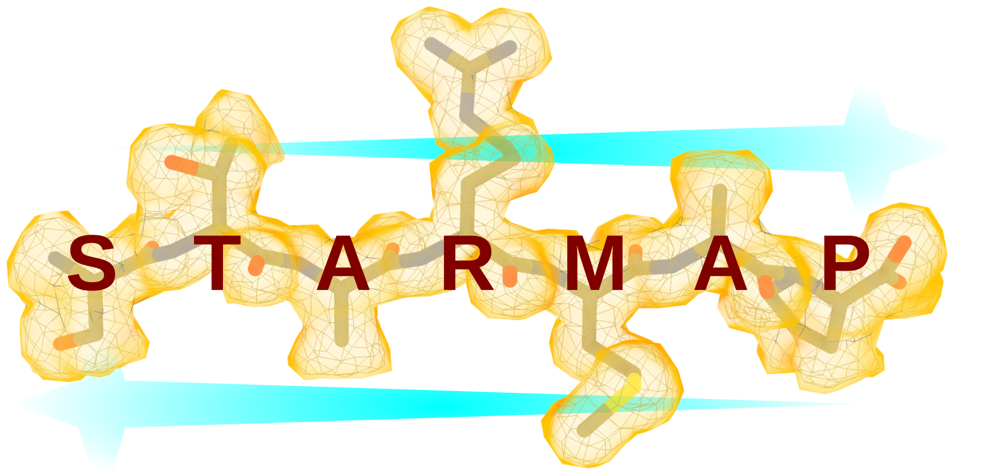

*******************
Welcome to StarMap!
*******************

*StarMap* is an easy-to-be-used mediator between the popular structural display program *ChimeraX* and the refinement program *Rosetta*.
*StarMap* provides a graphical interface within *ChimeraX* to control and execute *Rosetta*-based refinements. It includes options for symmetry,
local refinements, as well as independent map validation.
A series of analytical outputs, including precise magnification calibration (pixel size calibration) and Fourier shell correlations (FSC)
to assess the overall quality of the refinement and resolution (map versus model FSC) are being calculated.
Furthermore, per-residue Z-scores provide a fast guide to evaluate and improve local refinements as well as to identify flexible and
potentially functional sites in large macromolecular complexes.

In *StarMap v1.2* we have integrated support for *MEDIC (Model Error Detection in Cryo-EM)*,
a robust statistical model that identifies local backbone errors in protein structures built into cryo-EM maps
by combining local fit-to-density with deep-learning-derived structural information.

- *ChimeraX*: `https://www.rbvi.ucsf.edu/chimerax/ <https://www.rbvi.ucsf.edu/chimerax/>`_
- *Rosetta*: `https://www.rosettacommons.org/ <https://www.rosettacommons.org/>`_
- *MEDIC*: `https://github.com/gabriellareggiano/MEDIC/ <https://github.com/gabriellareggiano/MEDIC/>`_
- *StarMap*: `https://github.com/wlugmayr/chimerax-starmap/ <https://github.com/wlugmayr/chimerax-starmap/>`_
- *StarMap Manual*: `EPUB <StarMap.epub>`_

Note:

- *StarMap* for *ChimeraX* 1.4+ can be installed from the *ChimeraX* toolshed (*Tools->More Tools...*).
- *StarMap* for *ChimeraX* 1.3 with Qt5 support can be downloaded from the GitHub repository and must be installed as described in this manual.

Contact:

- *StarMap <starmap@marlovitslab.org>*

.. _starmap_citations:

How to cite StarMap
-------------------

If you use *StarMap* please read and cite:

- Lugmayr W., Kotov V. et al. StarMap: A user-friendly workflow for Rosetta-driven molecular structure refinement.
  Nat. Protoc. (2022). `https://doi.org/10.1038/s41596-022-00757-9 <https://doi.org/10.1038/s41596-022-00757-9>`_

- DiMaio F. et al. Atomic-accuracy models from 4.5-A cryo-electron microscopy data with density-guided iterative local refinement.
  Nat. Methods 12, 361-365 (2015). `https://www.nature.com/articles/nmeth.3286 <https://www.nature.com/articles/nmeth.3286>`_
  
- Reggiano G. et al. Robust residue-level error detection in cryo-electron microscopy models.
  Structure (2023). `https://doi.org/10.1016/j.str.2023.05.002 <https://doi.org/10.1016/j.str.2023.05.002>`_

If you are interested in the history and background of *StarMap* please read:

- Kotov V., Lugmayr W. How to solve a molecular tangram? Behind the paper:
  `https://protocolsmethods.springernature.com/posts/how-to-solve-a-molecular-tangram <https://protocolsmethods.springernature.com/posts/how-to-solve-a-molecular-tangram>`_

Contents
--------

.. toctree::
   :maxdepth: 2

   install_guide.rst
   getting_started.rst
   symmetry_tab.rst
   rosetta_tab.rst
   advanced_tab.rst
   user_tab.rst
   execute_tab.rst
   analysis_tab.rst
   analysis_medic_subtab.rst
   apix_tab.rst
   log_tab.rst
   commands.rst
   troubleshooting.rst
   references.rst
