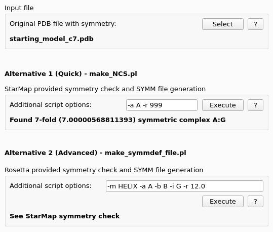
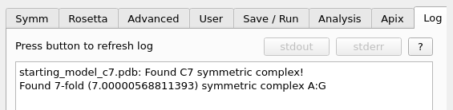
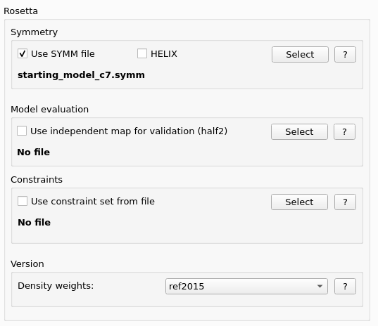

.. _symmetry_tab:

.. index:: Symmetry

Symmetry Tab
============

This tab provides an **optional** symmetry check on the input data.
Symmetry of the molecule of interest represents an important piece of information about the system,
and can provide additional restraint for challenging models (e.g. worse than 4.5A resolution).

When a symmetry is detected, a special Rosetta parameter file with the suffix *.symm* will be generated
in the directory where the input file is located. The output file will be named according to the input filename
e.g. if the input filename is *starting_model_c7.pdb* the output filename will be *starting_model_c7.symm*.
If no symmetry is detected, no additonal settings in StarMap will be changed.

Input file
-----------

* **Original PDB file with symmetry**:
  Here you can select your PDB file from the file system which you want to examine.
  If the path and filename is longer than 60 characters, the user interface will show a shortened display name.

StarMap Symmetry check
----------------------

* **Additional script options**:
  Most commonly useful additional script options are already preset in the user interface.
  The options can be changed and the parameters can be set with these options:

    -r <real>   : [default 12.0] the max CA-CA distance between two interacting chains
    -a <char>   : [default A] the chain ID of the main chain
    -f          : [default false] fast distance checking

* **Check**:
  Pressing the button will execute the script in the background on the command line.
  If no input file was selected, the file selection dialog will appear.
  A short result message will be displayed in the user interface below the options line.

For the full output message the *StarMap* user interface opens the *StarMap* *Log* tab and
displays the command line output of the execution.

If the symmetry check has been successful, the symmetry options in the *Advanced* tab of
the user interface will be enabled, the newly generated symmetry file name will be preset
and this symmetry file will be used during Shell and *Rosetta* execution script generation.

The symmetry check can be used independently of the *Rosetta* execution and run multiple times on various data sets.
For the execution scripts generation is important which symmetry values are set in the *Advanced* tab of the *StarMap* user interface.

Rosetta Symmetry check
----------------------

* **Additional script options**:
  Most commonly useful additional script options are already preset in the user interface.
  The following is the *help* output of the Rosetta commandline program **make_symmdef_file.pl**.

  | make_symmdef_file.pl
  | usage: /sw/rosetta/3.9/main/source/src/apps/public/symmetry/make_symmdef_file.pl [options]
  |
  | example:   make_symmdef_file.pl -m NCS -a A -i B C -r 12.0 -p mystructure.pdb
  | example:   make_symmdef_file.pl -m HELIX -a A -b B -i G -r 12.0 -p mystructure.pdb
  | example:   make_symmdef_file.pl -m CRYST -r 12.0 -c 42.4 41.2 88.6 90.0 90.0 90.0 -s P 1 21 1 -p mystructure.pdb
  |
  |  Common options:
  |    -m (NCS|CRYST|HELIX|PSEUDO) : [default NCS] which symmetric mode to run
  |        NCS: generate noncrystallographic (point) symmetries from multiple chains in a PDB file
  |        CRYST: generate crystallographic symmetry (fixed unit cell) from the CRYST1 line in a PDB file
  |        HELIX: generate helical/fiber symmetry from multiple chains in a PDB file
  |        PSEUDO: (EXPERIMENTAL) generate pseudo-symmetric system
  |    -p <string> : Input PDB file (one of -b or -p _must_ be given)
  |    -r <real>   : [default 10.0] the max CA-CA distance between two interacting chains
  |    -f          : [default false] enable fast distance checking (recommended for large systems)
  |    -q          : [default false] quiet mode (no files are output)
  |
  |  NCS-specific options:
  |    -a <char>   : [default A] the chain ID of the main chain
  |    -d <char>*  : the chain ID of other chains to keep in the output file
  |    -i <char>*  : [default B] the chain IDs of one chain in each symmetric subcomplex
  |    -e          : [default false] allow rigid body minimization of complete system
  |
  |  CRYST-specific options:
  |    -c <real>x6 : override the unit cell parameters in the PDB with these values
  |    -g <real>x3 : perturb the unit cell parameters (A,B,C only) in the PDB with these values
  |    -s <string> : override the spacegroup in the PDB with these values
  |    -k <real>   : (EXPERIMENTAL) Approximate the protein as a ball of this radius (only if no '-p'!)
  |    -h          : [default false] dont restrict translational motion along axes that do not change the system
  |
  |  HELIX-specific options:
  |    -a <char>   : [default A] the chain ID of the main chain
  |    -b <char>   : [default B] the chain ID of the next chain along the fiber/helix
  |    -i <char>   : the chain ID of a chain in -a's point symmetry group
  |    -t <real>   : [default 4] the number of subunits to generate along the -b direction
  |    -o          : [default false] make a fold-and-dock compatible symmdef file
  |    -e          : [default false] allow rigid body minimization of complete system
  |
  |  PSEUDO-specific options:
  |    -a <char>   : [default A] the chain ID of the main chain

