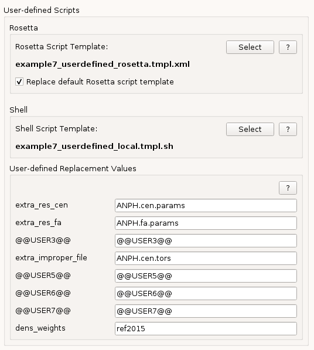
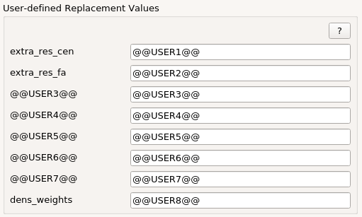

.. _user_tab:

User Tab
========

In this tab you can choose user-generated or modified *Rosetta* and *Shell* script templates.
The *Rosetta* and *Shell* script templates can be used independent of each other or in combination.

Rosetta
-------

In this box user-defined *Rosetta* XML script template can be choosen.

* **Select**:
  An external *Rosetta* XML script template can be located on the filesystem.

* **Replace default Rosetta script template**:
  Enabling this check box forces *StarMap* to use the choosen template instead of the default one
  when generating the execution scripts.

Shell
-----

In this box user-defined *Rosetta* shell script template can be choosen.

* **Select**:
  An external shell script template can be located on the filesystem.
  Template filenames must contain the keyword *local* or *cluster*.
  Once choosen this **template will be added to the pull down menu** in the corresponding *Save* tab based on the keyword.
  This shell script generation is independent of the choosen *Rosetta* XML script.

As an alternative predefined templates can be put in a special folder as described in
the :ref:`Templates <templates>` section.

StarMap Replacement Values
--------------------------

*StarMap* uses the following replacment values. This keywords can be used also in user-defined script templates.
For easier visuability the patterns start and end with **@@** in both *Rosetta* and *Bash* scripts.

The following patterns are valid and case sensitive:

* **@@ANISO@@**: Use anisotropic pixels in magnification calibration.
* **@@APIX_MAP@@**: The output filename of the magnification calibration.
* **@@CONSTRAINT_SET_FILE@@**: The path and filename of the selected constraint set.
* **@@CORES@@**: The amount of cores used by the MPI run.
* **@@DENSITY_FILE@@**: The density map file.
* **@@HIRES@@**: The density map resolution.
* **@@USE_SYMMETRY@@**: Run symmetry options.
* **@@INPUT_PDB_FILE@@**: The filename of the saved selection from *ChimeraX*.
* **@@NSTRUCT@@**: The number of output models.
* **@@ROSETTA_SCRIPT_EXE@@**: The filename of the used *Rosetta* script executable (e.g. *rosetta_scripts.default.linuxgccrelease*).
* **@@ROSETTA_SCRIPT_FILE@@**: The filename of the used *Rosetta* XML script.
* **@@STRATEGY@@**: The rebuilding strategy, either *auto* or *user*.
* **@@SYMMETRY_FILE@@**: If you run the symmetry check, the output filename will replace this pattern.
* **@@VALIDATION_HALF2_FILE@@**: The second half-map for the model evaluation.

In the XML file use e.g.::

  <LoadDensityMap name=loaddens mapfile="@@DENSITY_FILE@@"/>

Or in the runtime shell script this parameter can be set with the command line option::

  -edensity:mapfile @@DENSITY_FILE@@

User-defined Replacement Values
-------------------------------

*StarMap* provides 8 user-defined replacement tokens with the naming **@@USER1@@** up to **@@USER8@@**.
This tokens can be used in *Rosetta* XML and shell script templates.
During the execution script generation this tokens will be replaced by the changed user interface values.

To customize the *StarMap* GUI the label tokens can be overridden by environment variables with the corresponging number e.g.::

  export STARMAP_USER8="dens_weights"

The environment values *STARMAP_USER1* and *STARMAP_USER2* can be overriden as above, but if the values are not set or empty
they will be preset by **extra_res_cen** and **extra_res_fa** to make the ligand support with the corresponding template
easier for users.

If set the GUI would change like in the following image:

.. _ligands:

Ligands
-------

If you want to use more ligands during the refinement do:

For *extra_res_cen* and *extra_res_fa*, simply add multiple entries::

   -extra_res_fa LG1.params LG2.params

For *-extra_improper_file*, cat all the files together::

   cat LG1.tors LG2.tors > all.tors

and use that file as input.

Newer versions of *Rosetta* (3.10+) no longer need the **-extra_improper** directive (specifying it will not hurt however).

